**1. INTRODUCTION**

**1.1 Purpose:-**

-   This project can provide the easiest way to maintain objects in various locations
-   Using this project we can greatly reduce the time in calculating stock available in any location or laboratory.
-   Users can view his/her own lab status when required by simply login into software.
-   By using this software, inventory report can be obtained easily and it will help to survey the past hence decisions for future can be taken by authorities.
-   It is time saving and also users does not need to keep any written documentation.

**1.2Scope:-**

Right now in this software we can maintain stock by using different criteria’s such as add item, delete item(move to dead stock), update item status etc. and also lab-wise report is generated which gives brief idea of inventory.

**1.3 Definition:-**

Stock Digitization is a platform from which any Lab Assistant in PICT can maintain the inventory. Other users like HOD, Admin, Principal can also easily view lab / department-wise inventory status.

**1.4 References:**

a) [www.w3schools.com](http://www.w3schools.com)

b) [www.stackoverflow.com](http://www.stackoverflow.com)

c) Database System Concepts-Textbook by Avi Silberschatz, Henry F. Korth, and S. Sudarshan

**1.5 Developer’s Responsibilities:**

Projects of different sizes have different needs for how the people are organized. This is a mini-project and as developers of the same, we made sure that proper flow of the project is maintained including following the timeline and proper validations along with the documentation. We have strived to make this system as user friendly as possible.

**2. GENERAL DESCRIPTION:**

**2.1 Product function perspective:-**

The aim of this project is to maintain overall inventory of Laboratories. In this project or software we can simply add different roles such as Lab assistant, Department Stock In-charge, HOD, principal, Stock in-charge officer (Admin) etc. Where the HOD, Principle can change the password of his/her own account and also he/she can view the lab-wise report. The Lab Assistant can insert the data, update the inventory details such as number of particular items, consumables, furniture’s etc. and also Lab Assistant can give suggestion to HOD and Department Stock In-charge related to their status or requirnments.The Lab Faculty or lab In-charge can also see respective lab reports.

Here, in this software all the data of Laboratories are gathered at one place, so it saves time of finding different data at different places and also it calculates the Inventory details very quickly.

**2.2 User Characteristics:-**

1\. Principal-View status of all Laboratories and change password of his own account.

2\. HOD-View progress of departmental laboratories and change password of his own account.

3\. Lab In-charge- Insert items data update and modify it, view progress, change password and give suggestions.

4\. Department Stock In-charge- view Departmental report, add users, provide authority to Lab assistant to add, update or move items to dead stock or transfer.

5\. Admin/Stock in charge- view report, add users, provide authority to Department stock In charge to add, update or move to dead stock or transfer items.

6\. This module allows user to logout application further operation cannot be performing user exit.

**2.3 General Constraints:-**

1\. Consumable items are not traceable once come in use.

2\. Modification of lab item status by lab assistant can be done without authority of departmental stock in-charge.

3\. Currently website is deployed on localhost.

**2.4 Assumptions and Dependencies:-**

1\. It is assumed that the person using this system has little bit preknowledge about system flow.

**  
**

**3. SPECIFIC REQUIREMENTS:**

**3.1 Inputs and Outputs:-**

a) Registration of all types of users (Lab-assistant, Departmental stock in-charge, HOD, Principle, Admin (Stock in-charge Officer)) and items.

b) At least one lab under each department.

c) Item purchase date and time.

d) Successful updation of item status of transfer (if any)

e) Generation of pdf report whenever required.

**3.2 Functional Requirements:**

a) Login:

Precondition: Sign up with required details.

Post-condition: User Account is successfully created.

b) Modify Profile:

Precondition: User must logged in the software to fill up the details to modify.

Post-condition: Profile is modified successfully.

c) Modify item status:

Precondition: Lab assistant should have a user profile and must be logged in. The user has to enter DSR number of same item to be modified.

Post-condition: Item status updated successfully and entry is made in items table.

d) Moving items to dead stock:

Precondition: Proper DSR number must be entered.

Post-condition: Item should not be seen in lab table and should passed to Item-log table.

**3.3 Functional Interface Requirements:**

a) Menu bar is provides with hovers.

b) Logout button is present on each page.

**3.4 Performance Constraints:**

The Online Stock digitization can be accessed on PCs with internet connection. The performance wrt speed depends upon the strength/presence of a good internet connection. Currently the system cannot be accessed through a domain URL, since it is accessed via the localhost.

**4. SYSTEM DESIGN:**

**4.1 Use Case Diagram:-**

**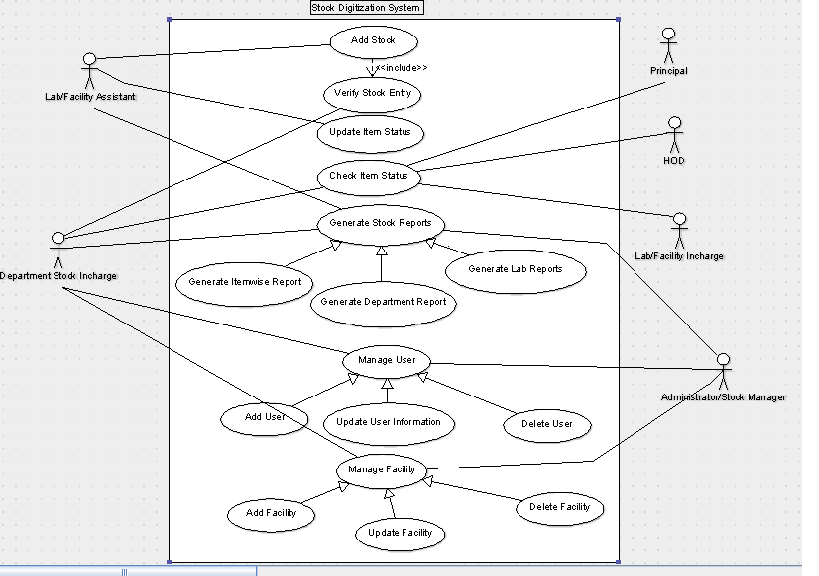**

Fig.4.1) Use Case diagram for stock digitization

**4.2 E-R Diagram:-**

**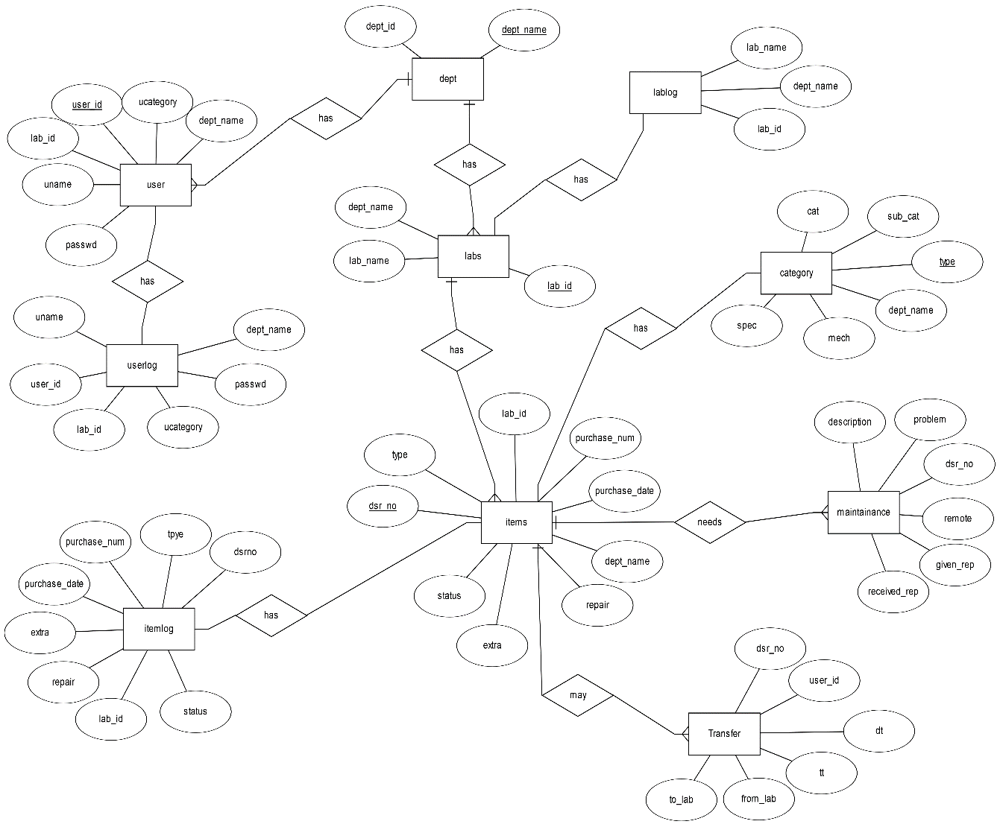**

Fig 4.2) E-R diagram for stock digitization

**4.3 Table definitions:**

**a) Table for User**

**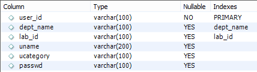**

**b)Table for User-log**

**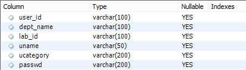**

**c) Table for Department**

**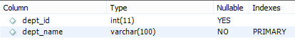**

**d) Table for Category**

**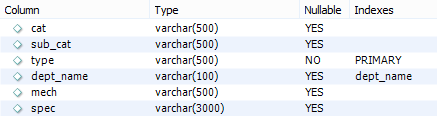**

**e) Table for Laboratory**

**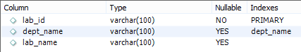**

**f) Table for Laboratory-log**

**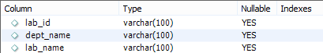**

**g) Table for Transfer**

**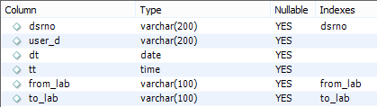**

**h) Table for Items**

**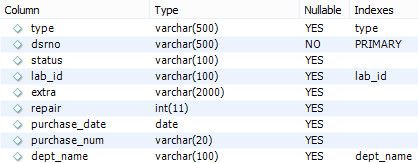**

**i) Table for Items-log**

**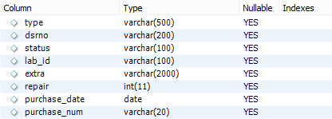**

**j) Table for Maintenance**

**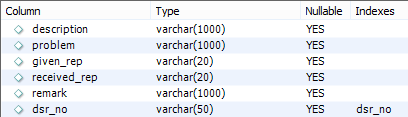**

**4.4 System Architecture:-**

Fig 4.4) System Architecture

**4.5 User interface design (Screenshots):-**

**4.5.1 Login Page**

****

**4.5.2Admin Page**

**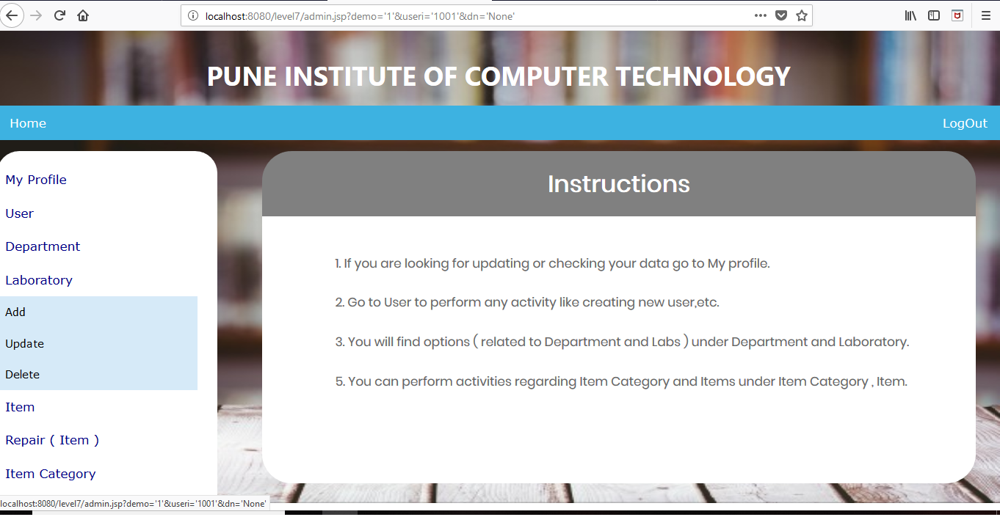**

**4.5.3 Send item to repair**

**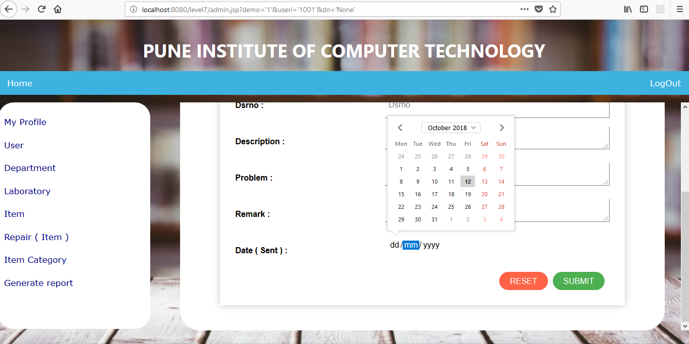**

**4.5.4 Delete department**

**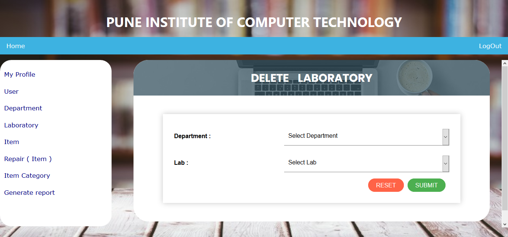**

**4.5.5 Lab assistant:**

**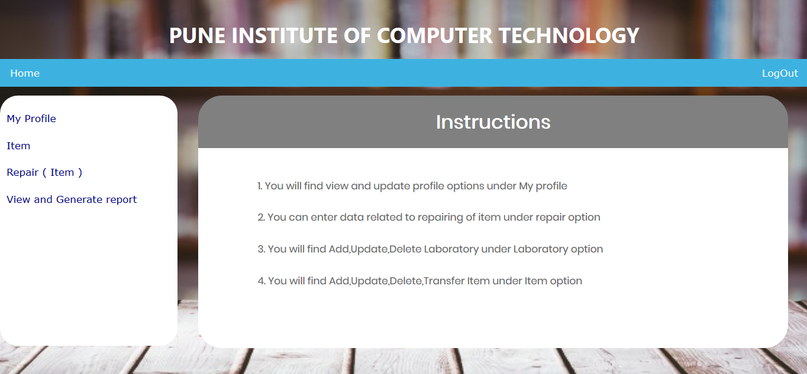**

**4.5.6 Validation for mandatory fields:**

**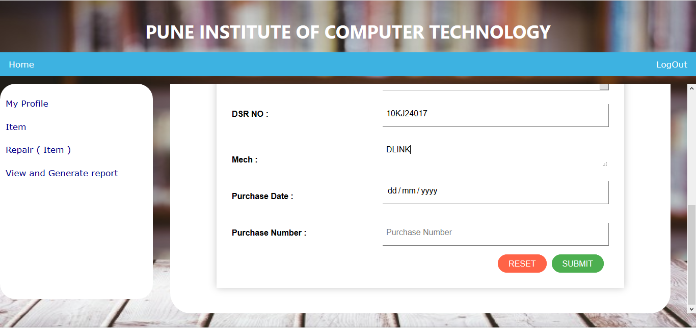**

**4.5.7 Validation of required fields:**

**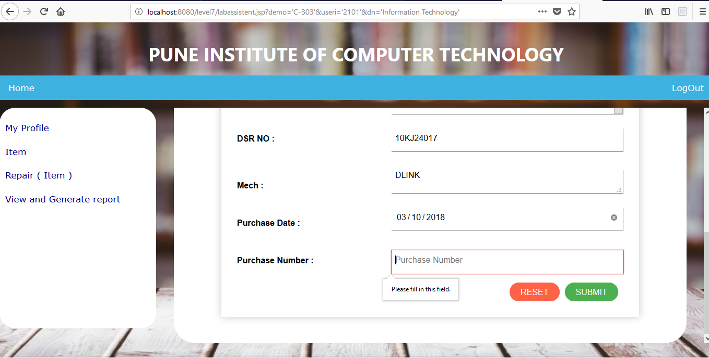**

**4.5.8Error handling using Alert box:**

**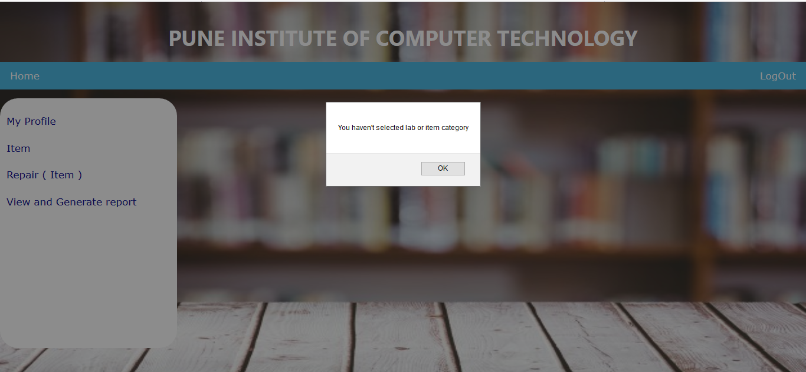**

**4.5.9 Message of success using alert box:**

****

**4.6 Error Messages/Alert Design:**

a) An alert box is displayed on successful login/logout and creation of account.

b) If a user account already exists, an alert box notifies the user about the same.

c) User also gets a message when password is changed successfully.

d) Acknowledgement of a successfully item status update is done via an alert box.

e) An error message is printed if the user enters wrong information eg. User_id, password, DSR_num etc…

**4.7 Test case design and execution:**

| **Test case No** | **Test Scenario**            | **Test Steps**                | **Test data**  | **Expected result**                               | **Actual result**                   | **Pass/Fail** |
|------------------|------------------------------|-------------------------------|----------------|---------------------------------------------------|-------------------------------------|---------------|
| 1                | User login                   | Enter User_id Password Submit | 1001 Admin@123 | Redirected to homepage                            | Successfully Redirected to homepage | P             |
| 2                | User login                   | Enter User_id Password Submit | 1001 Admin123  | Invalid Password Try again Redirected to homepage | As Expected                         | P             |
| 3                | Delete Item                  | Enter DSR_no                  | DSR100120      | Successfully Deleted Redirected to home page      | As Expected                         | P             |
| 4                | Delete Item from another lab | Enter DSR_no Submit           | DSR100120      | DSR_no not found  Redirect to home page           | As Expected                         | P             |
| 5                | Delete User                  | Enter User id Submit          | 11111111       | User not found                                    | As Expected                         | P             |

**5. SYSTEM IMPLEMENTATION:**

**5.1 Hardware and Software used:**

**1. System with minimum requirements as follows:**

a) Pentium IV processor

b) Color monitor

**2. Software used:**

a) Windows 8.1 / Windows 10

b) Netbeans IDE 8.2

**5.2 Tools used:**

a) HTML, CSS, JavaScript

b) MySQL database

c) Netbeans IDE

**5.3 Future work/Extension:**

The system scope can be extended further for all colleges also different type of companies can use this software for inventory management. This system can further be converted into a mobile application.

**5.4 Conclusion:**

The three parts which are essential for this project are User interface, creation of relational database and SQL engine. The Project is entirely based on database management system concepts. The backend use for project is MySQL and front-end is JAVA and HTML. The Coding of Sql queries are done through JAVA and HTML, CSS is properly done. The project is very feasible. The software engineering concepts are used to implement the project. The requirement analysis is understood and done for this project.
